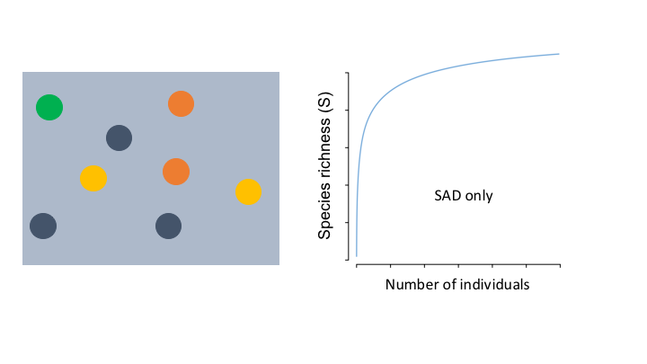

```{r setup, include=FALSE}
knitr::opts_chunk$set(echo = TRUE)
library(mobsim)
library(mobr)
```

# Introduction

The mobr package developed for estimating biodiversity and the components of biodiversity change. For more details see <https://github.com/MoBiodiv/mobr>. Our focus will be on quantifying biodiveristy change due to categorical covariates (e.g., experimental treatments).

mobr uses two complementary approaches to address the scale-dependence of biodiversity change:

 - analysis at two discrete scales: at the scale of samples (e.g., individual plots) and the treatment scale (i.e., all plots of a given treatment combined)
 - analysis across the scale continuum (only possible where the location of individual plots is known)

For the discrete analysis, species richness and its components are quantified and compared between treatments (at each scale). Extension to consider scale as continuous combines three different types of accumulation curves to quantify the contribution of each component to the observed change in species richness.

##  What are the components of species richness?
```{r echo=FALSE, fig.width=9, fig.height=3}
#	same PIE, different N (more individuals)
N_S50_N100 <- sim_sad(50, 100, sad_type = 'lnorm', sad_coef = list('cv_abund'=1))	# perfectly even community
N_S50_N200 <- sim_sad(50, 300, sad_type = 'lnorm', sad_coef = list('cv_abund'=1))

#	limits for plotting
ymax <- max(rare_curve(N_S50_N200))
xmax <- length(rare_curve(N_S50_N200))

par(mfrow=c(1,3))

plot(1:length(mobr::rarefaction(as.numeric(N_S50_N100), method='indiv')), 
	mobr::rarefaction(as.numeric(N_S50_N100), method='indiv'), 
	type='l', xlim=c(1, xmax), ylim=c(1, ymax), lwd=2.5, lty=2,
	ylab='Species richness', xlab='', cex.lab=1.5)
points(100, max(mobr::rarefaction(as.numeric(N_S50_N100), method='indiv')), pch=17, cex=2)		
lines(1:length(mobr::rarefaction(as.numeric(N_S50_N200), method='indiv')), 
	mobr::rarefaction(as.numeric(N_S50_N200), method='indiv'), 
	xlab='', ylab='', lwd=1.5)
points(300, max(mobr::rarefaction(as.numeric(N_S50_N200), method='indiv')), pch=19, cex=2)			
legend('bottomright', legend=c('Community A', 'Community B'), lty=c(1,2), bty='n', cex=1.25)
text(12,48, '(A)', cex=1.25)

# same PIE, same N, different S (at the limit)

PIE_S50_N200a <- sim_sad(50,200,  sad_type = 'lnorm', sad_coef = list('cv_abund'=1), fix_s_sim=T)
PIE_S30_N200a <- sim_sad(30, 200,  sad_type = 'lnorm', sad_coef = list('cv_abund'=1), fix_s_sim=T)#

ymax <- max(rare_curve(PIE_S50_N200a ))
xmax <- length(rare_curve(PIE_S50_N200a))

plot(1:length(mobr::rarefaction(as.numeric(PIE_S30_N200a), method='indiv')), 
	mobr::rarefaction(as.numeric(PIE_S30_N200a), method='indiv'), 
	type='l', xlim=c(1, xmax), ylim=c(1, ymax), lwd=2.5, lty=4,
	ylab='', xlab='Number of individuals', cex.lab=1.5)
points(200, max(mobr::rarefaction(as.numeric(PIE_S30_N200a), method='indiv')), pch=17, cex=2)
lines(1:length(mobr::rarefaction(as.numeric(PIE_S50_N200a), method='indiv')), 
	mobr::rarefaction(as.numeric(PIE_S50_N200a), method='indiv'), 
	xlab='', ylab='', lwd=1.5)
points(200, max(mobr::rarefaction(as.numeric(PIE_S50_N200a), method='indiv')), pch=19, cex=2)			
legend('bottomright', legend=c('Community A', 'Community C'), lty=c(1,4), bty='n', cex=1.25)
text(12,48, '(B)', cex=1.25)	

# different PIE, same N and S (at the limit)
N_S50_N200a <- sim_sad(50, 200, sad_type = 'lnorm', sad_coef = list('cv_abund' = 0.1), fix_s_sim = T)
PIE_S50_N200 <- sim_sad(50,200, sad_type = 'lnorm', sad_coef = list('cv_abund' = 4), fix_s_sim = T)

ymax <- max(rare_curve(N_S50_N200a ))

plot(1:length(mobr::rarefaction(as.numeric(PIE_S50_N200), method='indiv')), 
	mobr::rarefaction(as.numeric(PIE_S50_N200), method='indiv'), 
	type='l', xlim=c(1, xmax), ylim=c(1, ymax), lwd=2.5, lty=3,
	ylab='', xlab='')
points(200, max(mobr::rarefaction(as.numeric(PIE_S50_N200), method='indiv')), pch=17, cex=2)
lines(1:length(mobr::rarefaction(as.numeric(N_S50_N200a), method='indiv')), 
	mobr::rarefaction(as.numeric(N_S50_N200a), method='indiv'), 
	xlab='', ylab='', lwd=1.5)
points(200, max(mobr::rarefaction(as.numeric(N_S50_N200a), method='indiv')), pch=19, cex=2)
legend('bottomright', legend=c('Community A', 'Community D'), lty=c(1,3), bty='n', cex=1.25)
text(12,48, '(C)', cex=1.25)
```

##  Empirical example: Effects of plant invasion on biodiversity (Powell et al. 2011, 2013)
mobr requires a 'mob_in' object, consisting of:

 - a site x species matrix (sites are rows, species are columns)
 - a matrix detailing the environmental covariates, and spatial coordinates (if available they must be in columns named 'x' and 'y')
```{r}
# the site x species matrix
data("inv_comm"); inv_comm[1:6, 1:10]
# the environmental and spatial data 
data("inv_plot_attr"); head(inv_plot_attr)
# make the mob_in object
inv_mob_in <- make_mob_in(comm = inv_comm, plot_attr = inv_plot_attr)
inv_mob_in
```

### Visual inspection
Let's look at the individual based accumulation curves for the individual plots (sample scale) and all plots combined (group or treatment scale)
```{r echo = FALSE, fig.width=9, fig.height=6}
par(mfrow=c(1,2))
plot_rarefaction(inv_mob_in, 'group', 'uninvaded', 'indiv', pooled=F, lwd=2,
                 leg_loc='topright')
plot_rarefaction(inv_mob_in, 'group', 'uninvaded', 'indiv', pooled=T, lwd=4,
                 leg_loc=NA)
```

Now, the rank abundance distributions (again at the two scales)
```{r echo = FALSE, fig.width=9, fig.height=6}
par(mfrow=c(1,2))
plot_abu(inv_mob_in, 'group', 'uninvaded', type='rad', pooled=F, log='x')
plot_abu(inv_mob_in, 'group', 'uninvaded', type='rad', pooled=T, log='x')
```

### Discrete scale analysis
There are a myriad of biodiversity indices. We have attempted to chose a subset
of metrics that can all be derived from the individual rarefaction curve which
capture the aspects of biodiversity we are most interested in, namely:

1. Numbers of individuals (i.e., density effects)
2. The distribution of rarity and commonness (i.e., the SAD)
3. The spatial patchiness or aggregation of conspecifics.

The metrics we have selected are:

* **N - Number of individuals**
* **S - Observed species richness**
* **S_rarefied - Rarefied species richness (Hurlbert 1971)**
* **S_asymptote - Estimated asymptotic species richness using biased corrected method (Chiu et al. 2014)**
* **PIE - Probability of Interspecific Encounter (Hurlbert 1971)**
* **S_PIE - Effective number of species based on PIE (Jost 2007)**

Each of these metrics can be computed for either the sample or group scale individual rarefaction curves as shown in the figure below: 

{ width=85% }

```{r, fig.width=9, fig.height=9}
# call get_mob_stats
inv_stats <- get_mob_stats(mob_in = inv_mob_in, group_var = 'group', ref_group = 'uninvaded', n_perm = 50)
plot(inv_stats, multi_panel=TRUE)
```

###  How do changes in abundance, the SAD and aggregation contribute to changes in species richness?
To tease apart the contributions of component changes to observed changes in species richness, mobr uses three different types of accumulation curves:

 - spatial accumulation curve (spatial rarefaction, Chiarucci *et al* 2009 *Community Ecology*)
 - non-spatial accumulation curve (McGlinn *et al in prep*)
 - individual-based accumulation curve (individual rarefaction, Hurlbert 1971 *Ecology*, Gotelli & Colwell 2001 *Ecology Letters*)

##  Spatial accumualation curve
  
  - Accumlate plots based on proximity
  - Individuals are not shuffled

  

##  Non-spatial accumualation curve
  
  - Shuffle individuals across plots based on observed density & treatment SAD
  - randomly accumulate plots

  


##  Individual-based rarefaction curve
  
  - randomly sample individuals
  


### Plot the accumulation curves for the invaded and uninvaded plots
```{r echo=FALSE, fig.width=12, fig.height=6}
inv_plots <- inv_comm[which(inv_plot_attr$group=='invaded'),]
inv_coords <- inv_plot_attr[which(inv_plot_attr$group=='invaded'), c('x', 'y')]

uninv_plots <- inv_comm[which(inv_plot_attr$group=='uninvaded'),]
uninv_coords <- inv_plot_attr[which(inv_plot_attr$group=='uninvaded'), c('x', 'y')]

spatial_inv <- rarefaction(inv_plots, xy_coords = inv_coords, method='spat', latlong = FALSE)
spatial_uninv <- rarefaction(uninv_plots, xy_coords = uninv_coords, method='spat', latlong = FALSE)

non_spatial_inv <- rarefaction(inv_plots, method='samp')
non_spatial_uninv <- rarefaction(uninv_plots, method='samp')

# I've specified the effort argument here to the number of indiviudals in the in
ind_inv <- rarefaction(inv_plots, method='indiv', effort = 1:sum(rowSums(inv_plots)))
ind_uninv <- rarefaction(uninv_plots, method='indiv', effort = 1:sum(rowSums(inv_plots)))

par(mfrow=c(1,3))
plot(1:length(spatial_inv), spatial_inv, type='l', xlim=c(1, length(spatial_inv)), ylim=c(min(spatial_inv), max(spatial_uninv)), lwd=2, lty=2,
	ylab='Species richness', xlab='Number of plots', col = 'grey', main = 'spatial', cex.lab=1.5)
lines(1:length(spatial_uninv), spatial_uninv, lty=1, lwd=2)
legend(5, 80, legend = c('invaded', 'uninvaded'), lty = c(2, 1), col = c('grey', 'black'), bty = 'n' )

plot(1:length(non_spatial_inv), non_spatial_inv, type='l', xlim=c(1, length(spatial_inv)), ylim=c(min(spatial_inv), max(non_spatial_uninv)), lwd=2, lty=2,
	ylab='Species richness', xlab='Number of plots', col = 'grey', main = 'non spatial', cex.lab=1.5)
lines(1:length(non_spatial_uninv), non_spatial_uninv, lty=1, lwd=2)
legend(5, 80, legend = c('invaded', 'uninvaded'), lty = c(2, 1), col = c('grey', 'black'), bty = 'n' )

plot(1:length(ind_inv), ind_inv, type='l', xlim=c(1, length(ind_inv)), ylim=c(min(ind_inv), max(ind_inv)), lwd=2, lty=2,
	ylab='Species richness', xlab='Number of individuals', col = 'grey', main = 'individual', cex.lab=1.5)
lines(1:length(ind_uninv), ind_uninv, lty=1, lwd=2)
legend(5, 60, legend = c('invaded', 'uninvaded'), lty = c(2, 1), col = c('grey', 'black'), bty = 'n' )
```

### Quantify the component contributions to the change in species richness
```{r results='hide'}
knitr::opts_knit$set(progress = FALSE)
inv_mob_out <- get_delta_stats(mob_in = inv_mob_in, group_var = 'group', ref_group = 'uninvaded', n_perm = 20)
```

```{r fig.width=12, fig.height=12}
plot(inv_mob_out, trt_group = 'invaded', ref_group = 'uninvaded')
```

```{r  echo=FALSE, fig.width=6, fig.height=6}
overlap_effects(inv_mob_out, trt_group = 'invaded')
```